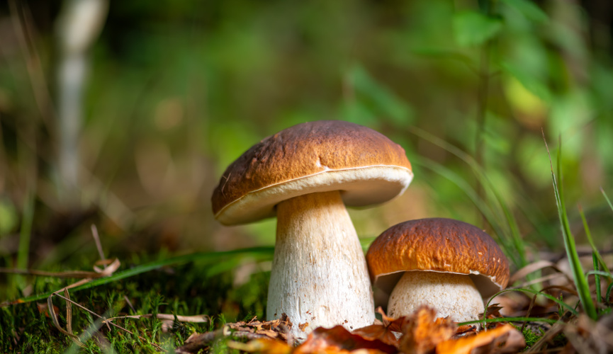

# Классификация грибов

Это интересный проект по применению процесса исследовательского анализа данных (EDA) и многочисленных алгоритмов классификации к [Mushrooms dataset, available from Kaggle](https://www.kaggle.com/datasets/uciml/mushroom-classification?datasetId=478&sortBy=voteCount), который состоит из 8143 данных наблюдений за грибами и 23 признаков, описывающих два класса грибов - съедобные и ядовитые.

# Ключевой вывод: для классификации ядовитых грибов следует использовать модель K-ближайших соседей (точность 99,63%) или модель линейного классификатора опорных векторов (точность 97,27%)! Также обратите внимание на цвет грибной оболочки, размер жабр, кровоподтеки и тип колец, поскольку они могут указывать на наличие ядовитого гриба!

## Оглавление

  - [Введение](#Введение)
  - [Источник данных](#Источник_данных)
  - [Методы анализа](#Методы_анализа)
  - [Алгоритмы](#Алгоритмы)
  - [Результаты TLDR](#Результаты_TLDR)
  - [Обсуждение](#Обсуждение)

## Введение

Я люблю совершать прогулки на природе. Часто во время этих прогулок по паркам и лесным массивам я натыкаюсь на грибы, растущие то тут, то там (иногда их приятно хлюпать). Я заметил, что эти грибы бывают самых разных форм и размеров, и это заставило меня задуматься о них. Как специалист по обработке данных, я отправился в Интернет, чтобы посмотреть, смогу ли я найти набор данных о грибах, который я мог бы проанализировать. Этот проект является результатом анализа того, что (в целом) делает грибы ядовитыми, а не съедобными. Читайте дальше для получения дополнительной информации!

## Источник_данных

Я нашел [mushrooms dataset on Kaggle](https://www.kaggle.com/datasets/uciml/mushroom-classification?datasetId=478&sortBy=voteCount), который состоит из 8143 записей о грибах, разбитых по 23 характеристикам, которые описывают грибы, и их классификации (либо "e"= съедобные, либо "p" = ядовитые). Что интересно, набор данных оказался на удивление чистым! Вот еще немного информации о наборе данных, взятой непосредственно из [Kaggle](https://www.kaggle.com/datasets/uciml/mushroom-classification?datasetId=478&sortBy=voteCount).:

> Этот набор данных включает описания гипотетических образцов, соответствующих 23 видам грибов семейства Agaricus и Lepiota, взятых из полевого руководства Общества Одюбона по североамериканским грибам (1981). Каждый вид идентифицируется как определенно съедобный, определенно ядовитый или как имеющий неизвестную съедобность и не рекомендуемый к употреблению. Последний класс был объединен с ядовитым. В Руководстве четко указано, что не существует простого правила для определения съедобности гриба; нет такого правила, как "пусть будет три листочка" для ядовитого дуба и плюща.

> Период времени: Передан в дар UCI ML 27 апреля 1987 года.

## Методы_анализа

Учитывая, что грибы в наборе данных классифицируются либо как "съедобные", либо как "ядовитые", это указывает на проблему бинарной классификации. Поэтому я разделил свой анализ на две основные части:

1. Предварительный анализ данных
2. Прогнозирование классификации грибов

## Алгоритмы

Чтобы предсказать бинарные классификации, я использовал ряд алгоритмов и выбрал наилучший алгоритм (обсуждается позже). Вот алгоритмы, которые я использовал:
- Гауссовский наивный байесовский
- Случайный лес
- Дерево решений
- Логистическая регрессия
- SVC (классификация опорных векторов)
- K-Ближайшие соседи
- XGBoost

## Результаты_TLDR

Из семи алгоритмов, которые использовались для классификации грибов, 3 не соответствовали модели и поэтому были отброшены для окончательного анализа. Из четырех оставшихся моделей (наивная байесовская, логистическая регрессия, SVC и K-ближайших соседей) было обнаружено, что KNN и SVC обладают наибольшей точностью и повторяемостью (>96%). Было установлено, что наиболее важными признаками, влияющими на ядовитость грибов в соответствии с моделью SVC, являются цвет вуали, размер жабр, кровоподтеки и тип колец грибов.

## Обсуждение

В этом проекте наша цель - найти наилучший из возможных алгоритмов, который классифицирует грибы как съедобные или ядовитые. Мы использовали 7 алгоритмов и оценили их эффективность. Теперь мы обсудим несколько оценочных показателей, чтобы определить наилучший алгоритм, который следует использовать для прогнозирования классификации грибов. Но сначала немного терминологии! Большинство показателей оценки определяются в терминах положительных и отрицательных значений, как показано в матрицах путаницы. В нашей матрице путаницы для задачи бинарной классификации положительное значение определяется как 1, что соответствует ядовитым грибам. Следовательно, отрицательный класс соответствует 0, то есть съедобным грибам. Это говорит нам о том, что наши модели определяют, какие грибы являются ядовитыми (что является гипотезой), а не наоборот. Поэтому, прежде чем мы определим показатели оценки, рассмотрим еще несколько терминов:

- TP (истинные положительные результаты): сколько точек данных были правильно классифицированы как ядовитые (фактические = "p", прогнозируемые = "p").
- FP (ложноположительные результаты): сколько точек данных были ошибочно классифицированы как ядовитые (фактические = "e", прогнозируемые = "p").
- FN (Ложноотрицательные значения): сколько точек данных было неправильно классифицировано как съедобные (фактические = "p", прогнозируемые = "e").
- TN (истинные отрицательные значения): сколько точек данных были правильно классифицированы как съедобные (фактические = "e", прогнозируемые = "e").

**Accuracy**
определяется следующим образом: $\frac{TP+TN}{TP+TN+FP+FN}$

- Показатель точности хорош для сбалансированного набора данных (который у нас есть) и для тех случаев, когда важен каждый класс.

**Precision** 
определяется следующим образом: $\frac{TP}{TP+FP}$

- Показатель точности хорош для измерения того, насколько часто класс "p" действительно классифицируется как класс "p", т.е. максимизируется по TPs. 
- В нашем случае это хороший показатель для сравнения наших моделей, поскольку нам нужно правильно предсказать, что ядовитые грибы являются ядовитыми, а не съедобными, поскольку это может привести к плохим последствиям для человека!

**Recall**
определяется следующим образом: $\frac{TP}{TP+FN}$

- Показатель отзыва хорош для измерения того, насколько часто класс "е" действительно классифицируется как класс "е", т.е. для максимизации TNs.
- Это также хороший показатель для сравнения наших моделей, поскольку мы также хотим правильно классифицировать съедобные грибы!

**F1 Score** определяется следующим образом: $2\times \frac{precision\times recall}{precision + recall}$

- Показатель F1 называется "средним гармоническим значением между точностью и запоминаемостью". 
- Это означает, что он является хорошим показателем для определения того, насколько часто съедобные и ядовитые грибы правильно классифицируются.

**ROC/AUC Score**
- Кривая ROC (рабочая характеристика приемника) представляет собой график зависимости коэффициента TP от коэффициента FP.
- Показатель AUC (площадь под кривой) является мерой площади под кривой ROC.
- Показатель ROC/AUC хорош для измерения вероятности правильных прогнозов, сделанных как для съедобных, так и для ядовитых грибов.

Рассмотрев все эти показатели, мы определим наш основной показатель как точность, поскольку мы заинтересованы в том, чтобы свести к минимуму вероятность употребления ядовитых грибов, что произойдет только в том случае, если большинство ядовитых образцов в наборе данных будут правильно классифицированы.

Еще одна вещь, прежде чем мы начнем оценивать наши модели, - мы отмечаем, что несколько алгоритмов обеспечили 100%-ный результат по каждой метрике. Это показывает, что эти модели, скорее всего, были переоборудованы, т.е. модель усвоила определенные правила из обучающих данных и смогла применить их к тестовому набору данных как есть. Мы не будем учитывать эти усовершенствованные модели (случайный лес, Дерево решений, K-ближайших соседей и XGBoost) для окончательной оценки.

Итак, теперь у нас достаточно информации, чтобы приступить к оценке наших моделей. Давайте еще раз посмотрим на таблицу показателей производительности, после того как отфильтруем переоборудованные модели на основе точности.

Основываясь на нашем основном показателе, точности, мы обнаружили, что модель KNN показала наилучшие результаты, за ней следует SVC (линейное ядро), за которым следует логистическая регрессия. Наименее точной моделью была модель наивного Байеса. Модель KNN обеспечила точность 99%, модель SVC - 98%, логистическая регрессия - 94% и, наконец, наивный метод Байеса - 90%. Это означает, что модель KNN классифицировала 99% всех ядовитых грибов как ядовитые.

Мы обнаруживаем, что другие показатели также имеют сходные показатели, при этом KNN показывает наилучшие результаты, за ним следует SVC, затем логистическая регрессия, затем наивный Байесовский анализ. Однако, с точки зрения запоминания, мы обнаруживаем, что KNN имеет 100%-ную память, что показывает, что он правильно классифицировал 100% съедобных грибов как съедобные. Интересно!

**Основываясь на проведенном обширном анализе и сравнении показателей, мы пришли к выводу, что для классификации этого набора данных следует использовать алгоритм K-ближайших соседей или модель классификатора опорных векторов.**

Итак, каковы же признаки, которые делают грибы ядовитыми? Согласно модели SVC, основными признаками, по которым гриб может быть ядовитым, являются цвет его покровов, размер жабр, кровоподтеки и тип колец**. Признаки, которые внесли наименьший вклад в классификацию, включают расстояние между жабрами, корень стебля, форму стебля, крепление жабр и количество колец, и это лишь некоторые из них.

Поэтому, чтобы завершить этот анализ, если бы у меня был с собой алгоритм, когда я был в лесу, исследуя грибы, который подсказывал бы мне вероятность того, что гриб ядовитый или нет, я бы выбрал либо алгоритм KNN, либо алгоритм SVC. Я бы также обратил пристальное внимание на цвет вуали, размер жабр, синяки и тип колец у грибов, чтобы подтвердить предсказания алгоритма.
